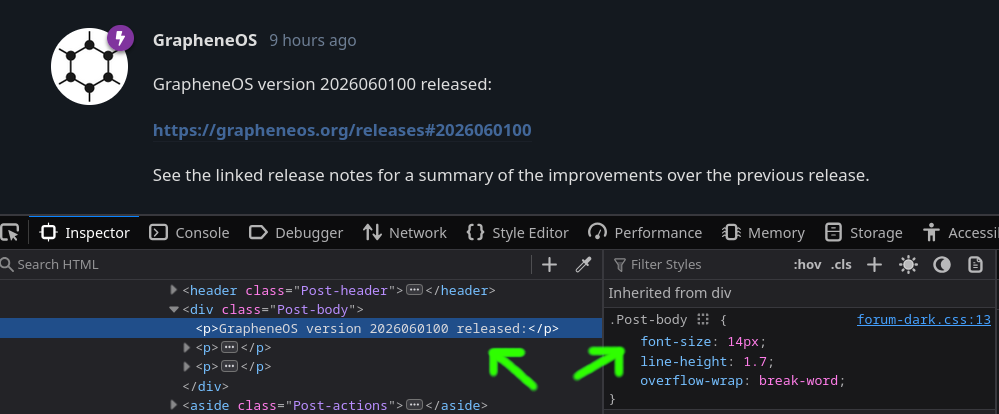
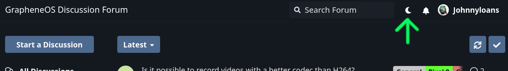
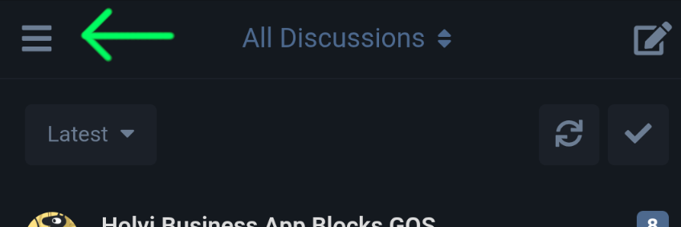
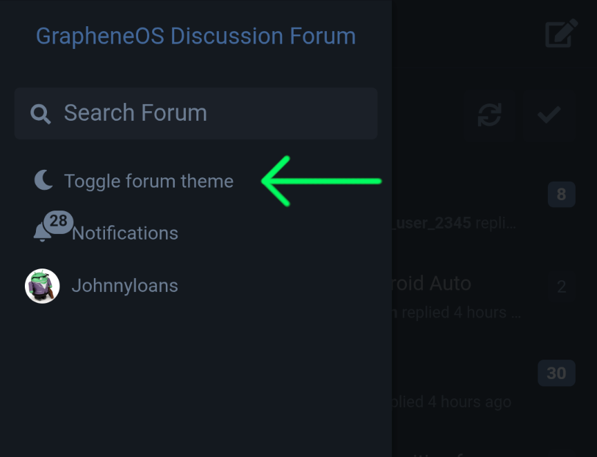

# Readability Improvements For The GrapheneOS Forum

A collection of uBlock Origin filter lists to improve readability on [discuss.grapheneos.org](https://discuss.grapheneos.org).

These filter lists apply cosmetic changes via CSS, affecting only how the site appears in your browser — not its content. The one exception is the welcome banner on the home page, which is hidden on the assumption that users are already familiar with the official forum. ("Welcome to the GrapheneOS Discussion Forum — Official forum for discussing GrapheneOS and related topics.")

> ### Note:
> 
> As with anything, blindly copying files or commands can lead to heartache. All of the files here are from me — JohnnyLoans — but inspect them yourself. There is a quick lesson over at the ["How Does It Work" Section](#how-does-it-work) to learn more about the lists.

## Table of Contents

- [Features](#features)
- [Screenshots](#screenshots)
- [Installation Instructions](#installation)
- [How Do The Rules Work - A Quick Lesson](#how-does-it-work)
- [FAQ](#faq)

## Features

- **High Contrast**
- **Larger Text**
- Light Mode has **only dark text**! No more white text.
- **Toggles & Buttons** are more prominent
- **Hide the Welcome Banner** — Experienced users are aware
  - "Official forum for discussing GrapheneOS and related topics."
- **Pixel Model Color Coding**: Device support status is color coded

  💚 Green: Pixels with MTE

  🩷 Pink: Pixels without MTE

  ❤️ Red: Pixels that are not supported

> Note: Color coding will **not** update automatically when devices reach [End of Life](https://endoflife.date/pixel).
> Either: edit the list yourself, check back for a new release, or don't change a thing and enjoy life. :)

## Screenshots

> Tip: Don't like everything you see? The lists are well-documented to edit to your heart's content!

### Dark Mode

  
Click Here To View

#### Discussion - Desktop/Tablet

#### Home page - Desktop/Tablet

#### Tags - Desktop/Tablet

#### Settings - Desktop/Tablet

#### Create A New Discussion - Desktop/Tablet
1) The OK button is low contrast currently because it is disabled — a primary tag isn't selected yet.
2) Long tag names aren't cut off

### Mobile - Narrow Screens
> Note: the right image implemented a change suggested on line 9 of both 'dark' configs to make the replying person slightly darker. I like it this way.

### Light Mode

  
Click Here To View

#### Discussion - Desktop/Tablet

#### Home page - Desktop/Tablet

#### Tags - Desktop/Tablet

#### Settings - Desktop/Tablet

#### Create A New Discussion - Desktop/Tablet
1) The OK button is low contrast currently because it is disabled — a primary tag isn't selected yet.
2) The names of long tags aren't cut off.

### Mobile - Narrow Screens

## Installation

1. **Add The uBlock Origin Extension To Your Browser** (if you haven't already)
   - [Get uBlock Origin](https://github.com/gorhill/uBlock#uBlock-origin-ubo)
   - Most Chromium and Firefox-based browsers support extensions on desktop; on Android consider: Edge, Cromite or ~~IronFox~~, Fennec (although, Firefox is slow on Android)
     - This is not an endorsement for any browser; these are a few that allow extensions.
     - IronFox doesn't work with the GOS forum at the time of writing. Versions 150.0.2 through 151.0.3 affected. ([Issue has been reported](https://gitlab.com/celenityy/Phoenix/-/work_items/5))
     
2. **Choosing One Filter List**
   - Go to [discuss.grapheneos.org](https://discuss.grapheneos.org) on your device
     - Compare if it looks like the Desktop/Tablet screenshots shown here or mobile.

     
> #### Two optional tips for Tablets:
> Foldable phones have two screens — narrow and big. If you view the forum on both screens, here are two tips to consider:
> - Have two copies of your browser — one in private space and one in your normal profile. Each browser has its own config — mobile or desktop. Open the corresponding browser depending on if you're on the big screen or not.
> - Using a single browser, you can use the narrow screen (mobile) config on the outer screen. For the big screen, make your browser take up half of the screen to make it narrow via the 'split' feature.

   - The following files are available. **(A browser can only have one)**
     - `dark-desktop.txt` — Dark mode for Desktop/Tablets
     - `dark-mobile.txt` — Dark mode for phones (narrow screens)
     - `light-desktop.txt` — Light mode for Desktop/Tablets
     - `light-mobile.txt` — Light mode for phones (narrow screens)
   - At the top of this website click on the desired file name
   - Either:
     - Download the file
     - Copy the text

3. **Add This Filter List** (Picture instructions below)
   - In your Web Browser, Go to extensions, open uBlock Origin, and open its settings
   - At the top are tabs. Go to the one that says: "My Filters" or "Custom Filters"
   - Import your downloaded file OR copy and paste the contents.
   - There is either a save button or check mark to push before leaving this page.
   - To view the changes, either: refresh the [forum website](https://discuss.grapheneos.org) if you have it open or open the [website](https://discuss.grapheneos.org) in a new tab.

### Adding The List - Mobile - Fennec  ~~IronFox~~

  
Click Here To View The Picture Instructions

### Adding The List - Desktop - Firefox

  
Click Here To View The Picture Instructions

## How Does It Work

  Don't feel intimidated if you don't feel like an expert after this 5-minute lesson — that's unrealistic. There's no test after and you don't have to create dozens of rules from scratch.
  The goal is grasping a vague idea of how it works so you can examine the rules yourself to make sure nothing fishy is going on or change one to your liking. After this short lesson, you'll be able to confidently find the words `font-size` and change the number from 17 to 21 — simple enough! :)
  
  
  For creating a new rule, I would copy and paste another rule that performs a similar task to your goal and change what's needed.

### A change for the entire website
> discuss.grapheneos.org##:root { --text-color: #ffffff !important; }

- **discuss.grapheneos.org**
  - Apply the following rule to the website `discuss.grapheneos.org`.
- **!important;**
  - Override the website default values.
- **--text-color**
  - This is a variable.
  - We want to change `--text-color`.
  - We cannot create variable names ourselves. The website is coded to use `--text-color`. Much of the text is this color but **not** all.
    - Doing `--Fireworks: yes` won't do anything.
- **#ffffff**
  - Hex color code for white. (We will get to this color coding soon, don't worry.)
- **root {**
  - Where to apply this change. In this case, it is at "root" which means everywhere.
  - Note: We have curly brackets after the word "root".

### Color Picker
I used the following website to find the hex codes for various colors. Click a color and look at or click on the various brightness options available.
https://www.w3schools.com/colors/colors_picker.asp

### Discovering What To Change
In a desktop browser, we can discover the special names for what we want to change by opening developer tools. We right-click on what we want to change and then click 'Inspect'. As seen below, a comment is selected and — to the right — in the section called ".Post-body" we have "font-size".

Let's create a new rule to increase the font size.

### Changing a specific area of the website (AKA section) (AKA element)
> ! Comment text ## Default text-size: 14px
>
> discuss.grapheneos.org## .Post-body:style( font-size: 17px !important; )

- **!**
  - A line starting with "!" will be ignored by the computer as **not a rule** — just notes for humans to read.
- **.Post-body**
  - This is the name used for every comment.
- **font-size: 17px**
  - We change the font size to 17px (up from 14px as the note says)
  - We could change lots of other things:
    - background
    - color
    - padding (spacing)
    - left (positioning)
    - font-weight: bold
    - etc.
  - **:style(**
    - adjust the styling for this section.
    - Note the parentheses — not curly brackets.

### Multiple Changes
> discuss.grapheneos.org## .Post-body blockquote:style( background: #003c66 !important; color: var(--text-color) !important; font-size: 17px !important; )

Previously, we set the text size for comments. This rule is more specific. This is for **quotes** inside of a comment. In this rule, we could override the "font-size" to be different from the rest of the comment. This rule would take precedence over the more general rule for "font-size" in the rest of the comment.

If this concept doesn't make sense, think of it like this statement to the browser: "For all comments do this unless it's a quote, then do these other things like having a rectangular block of color behind the text."

- We can do another change after every **!important;**
- **.Post-body blockquote**
  - The name for quotes inside a comment.
- **color: var(--text-color)**
  - In this instance, "color" is the color of the text in the quote. We set it to be the same as the variable called "--text-color", which is white.

### Search
> discuss.grapheneos.org## header.DiscussionHero:has(.TagLabel-name:has-text(Development)):style(--hero-bg: #ff0000 !important)

Websites are like a [Matryoshka doll](https://en.wikipedia.org/wiki/Matryoshka_doll) — there are deeper layers.
For example: We have a **discussion** about WiFi > a **column of comments** is just 1 thing we see on the page > inside the first comment is the **user's picture and a quote** > inside of the quote is a **website link**.

In the above rule, we are searching for the text "Development"; however, applying the color where we found the word "Development" will not work. The website applies the color higher up in the hierarchy. So, the above rule applies the color higher up in the hierarchy as explained below.

- **header.DiscussionHero:has(**
  - **header.DiscussionHero** is where we want to apply the new styling. In this case, a color.
  - **:has(** means we will search deeper into the layers for something.

- **.TagLabel-name:has-text(Development)**
  - Inside of **header.DiscussionHero**, go to a section called **.TagLabel-name** and then search for the text "Development".
    - If the browser doesn't find `Development`, then don't do anything yet. Go to the next rule which could be another search for a phrase like "Off Topic".
  - **has-text(Development)**
    - Search for the word `Development` inside of **.TagLabel-name**
    - Make sure the capitalization of each letter is correct for a search.
- **--hero-bg: #ff0000**
  - As mentioned earlier, the new color gets applied at **header.DiscussionHero**.

### Advanced Search
> ! non MTE = Light blue ## Pixel 6-7, 2023 Fold, Tablet
>
> discuss.grapheneos.org## .DiscussionHero-items .TagLabel:has-text(/Pixel ([6-7]|F|T)/):style(--tag-bg: #ff99ff !important; )

- **has-text(/Pixel ([6-7]|F|T)/)**
  - A search for text
  - **/Pixel ([6-7]|F|T)/**
    - the forward slashes indicate that we want to use a `Regular Expression` — a powerful search tool usually called regex. Regex is complicated; there are many free resources to learn more about it.
    - This will look for: `Pixel 6`, `Pixel 7`, `Pixel F`, and `Pixel T`
      - Consequently, it'll find `Pixel 6a`, `Pixel 7 Pro`, `Pixel Fold`, `Pixel Tablet`, etc.
    - instead of **/Pixel ([6-7]|F|T)/**, we could have put **Pixel 6** to do a simple search.

    
    

  > Note for advanced users: Some sections of the forum have the text " Pixel 6" — with a leading space — instead of "Pixel 6" so be cautious of `^` (start-of-text anchors) in your regex.

### Search   ...again
> !!!!!!!! Start a New Discussion > Adding Tags !!!!!!!!
>
> ! Alpha & Beta
>
> discuss.grapheneos.org##.SelectTagList > li:is([data-index="36"],[data-index="37"]):style(color: #00ccb8 !important;)

This rule is for when a user is creating a new discussion and they're selecting which tags to use.

- As the comment suggests, this rule is for the tags `Alpha` and `Beta`. Each tag has a unique number, which can be discovered by right-clicking on the tags on the webpage as we learned earlier in [Discovering What To Change](#discovering-what-to-change)
- **.SelectTagList > li:is([data-index="36"]**
  - If **.SelectTagList > li** has **data-index="36"**, change the color. ( **color: #00ccb8** )
- **,[data-index="37"]**
  - If it has **data-index="37"**, change the color. ( **color: #00ccb8** )
 

## FAQ

### 1) Will I get hacked and my information stolen using this?

   No, these are cosmetic only — no scripts or changing of site data. Feel free to examine the rules yourself. This is a quick lesson: [How Does It Work](#how-does-it-work)

### 2) I can't see anything. I added the light-theme rules but the website is in dark mode. (or vice-versa)

   #### Desktop Instructions
   
   At the upper-right corner of the webpage, there is a button in the shape of a crescent moon or sun just to the right of the search box. Click on this to change the theme. Problem fixed.
   

   #### Mobile Instructions
   
   Step 1: At the top left of the screen is a hamburger menu, tap on this. (If you are currently viewing a discussion, tap on this corner twice with a small delay between taps for the page to load — once to get back to the home page, then again to open the sidebar menu.)
   
   
   Step 2: In the upper left area of the screen, there is a button just below the search bar. It is in the shape of a crescent moon or sun. Tap on this to change the theme. Problem fixed.
   
   
   
### 3) Your color and text size choices are abysmal.

   The lists are well-documented for editing to suit your needs.

   The lists available here improve readability for those in need. Design was a secondary consideration. Personally, I wouldn't have the text size this big. I had the text size smaller but I thought: "I can read this, but not everyone can". So, I increased the size again. Furthermore, there are a limited number of colors that are at the opposite end of the brightness spectrum to choose from.
   
   PRs and feedback are welcome.
   
### 4) [How Does It Work](#how-does-it-work) has technical inaccuracies.

   If there is an error, please report it; however, the inaccuracies could be intentional.

   That section is for everyone in the world: non-English speakers and non-technical people.
   For example, it's uncertain whether the word "element" translates cleanly to every language using online tools and it could be confusing for native English speakers as well. Plus, it's easier to learn a concept without stumbling through jargon.
